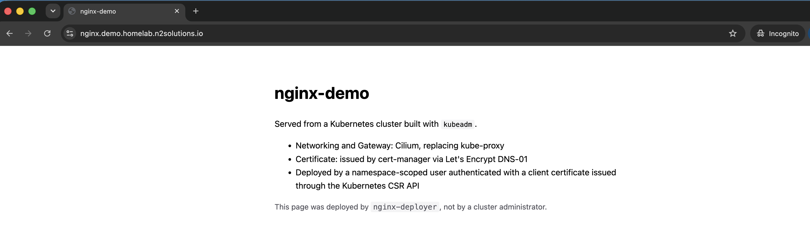
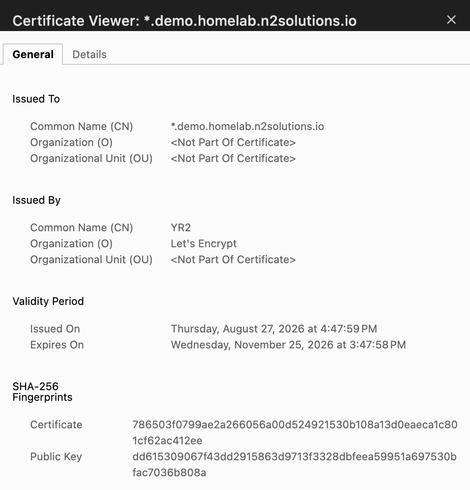

# kubeadm cluster with RBAC-scoped application deployment

A three-node Kubernetes cluster built with `kubeadm`, serving a static nginx site
over HTTPS. The application is deployed by a namespace-scoped user authenticated
with a client certificate issued through the Kubernetes CSR API — not by a
cluster administrator.

| | |
| --- | --- |
| Cluster | kubeadm, Kubernetes 1.33 — 1 control plane, 2 workers |
| Networking | Cilium, kube-proxy replaced |
| Ingress | Gateway API, Cilium as controller |
| Certificates | cert-manager → Let's Encrypt via DNS-01 |
| Identity | Kubernetes CSR API, client certificates, group-bound RBAC |

## How it fits together

Each layer is built by the one above it, and each has its own document.

```
  Dell server → Proxmox                                docs/infrastructure.md
        │
        ├─ 3 × Ubuntu VMs, declared in OpenTofu/Terragrunt
        │  plan on PR, apply behind a human gate
        │
        ▼
  Node preparation                                     n2solutions.kubeadm
        │  containerd, kernel settings, swap, staged packages
        ▼
  kubeadm cluster                                      docs/build-cluster.md
        │  1 control plane + 2 workers, Cilium, no kube-proxy
        ▼
  Platform                                             docs/deploy-application.md
        │  Gateway API · LoadBalancer pool · cert-manager
        ▼
  Access control                                       docs/deploy-application.md
        │  namespace · Role · RoleBinding · CSR-issued user
        ▼
  Application                                          manifests/apps/nginx
           nginx + HTTPRoute, deployed BY that user
```

The last two steps are the point of the exercise. Everything above them exists to
make that boundary demonstrable.

## Verification

Cluster:

```console
$ kubectl get nodes
NAME                    STATUS   ROLES           AGE     VERSION
homelab-demo-cp-0       Ready    control-plane   2d18h   v1.33.13
homelab-demo-worker-1   Ready    <none>          2d17h   v1.33.13
homelab-demo-worker-2   Ready    <none>          2d17h   v1.33.13
```

The identity, derived entirely from the client certificate's subject — no user
object exists, and nothing else was configured:

```console
$ kubectl --kubeconfig=nginx-deployer.kubeconfig auth whoami
ATTRIBUTE   VALUE
Username    nginx-deployer
Groups      [nginx-deployers system:authenticated]
```

The privilege boundary:

```console
$ kubectl --kubeconfig=nginx-deployer.kubeconfig auth can-i ...

create deployments  -n nginx-demo     yes
create httproutes   -n nginx-demo     yes
get    pods/log     -n nginx-demo     yes

get    secrets      -n nginx-demo     no    ← the site's TLS private key lives here
update gateways     -n nginx-demo     no    ← shared infrastructure, admin-owned
create deployments  -n kube-system    no    ← Role is namespaced; no ClusterRole bound
list   nodes                          no    ← cluster-scoped resources are invisible
list   namespaces                     no
```

Routing and TLS:

```console
$ kubectl -n nginx-demo get gateway,httproute
NAME           CLASS    ADDRESS       PROGRAMMED   AGE
demo-gateway   cilium   10.30.30.30   True         18h

NAME             HOSTNAMES
https-redirect   ["*.demo.homelab.n2solutions.io"]
nginx            ["nginx.demo.homelab.n2solutions.io"]

$ curl -sS -o /dev/null -w '%{http_code} %{ssl_verify_result}\n' https://nginx.demo.homelab.n2solutions.io/
200 0
```

`ssl_verify_result 0` means the certificate verified against the public trust
store — a real Let's Encrypt certificate, not self-signed.

The site, served over HTTPS and deployed by the scoped user:



The certificate, issued by cert-manager from Let's Encrypt via a DNS-01 challenge
— covering the whole cluster zone rather than a single host:



<!--
  Optional third screenshot, if you want to evidence the infrastructure pipeline:
  
-->

## Documentation

| | |
| --- | --- |
| [`docs/design.md`](docs/design.md) | Design decisions, trade-offs, and where this access model breaks down |
| [`docs/build-cluster.md`](docs/build-cluster.md) | Building the cluster, step by step |
| [`docs/deploy-application.md`](docs/deploy-application.md) | Platform services, the CSR user, and deploying the application |
| [`docs/infrastructure.md`](docs/infrastructure.md) | How the underlying VMs are provisioned and operated |
| [`manifests/`](manifests) | Everything applied, as tracked files |
| [`AI_DISCLOSURE.md`](AI_DISCLOSURE.md) | Degree of AI assistance, per file |

Node preparation is handled by
[`n2solutions.kubeadm`](https://github.com/n2solutionsio/ansible-collection-kubeadm),
a public Ansible collection written alongside this work.

## About this environment

This runs on my own hardware — a Dell server running Proxmox, on a segmented
network. It is a homelab in the sense that I own it and it costs me nothing (except electricity) to
run; it is not a homelab in how it is built.

The environment is managed the way I would manage production: infrastructure
declared in OpenTofu and Terragrunt with state in object storage, changes applied
through a pull-request pipeline where plan is automatic and apply requires a
human, no static credentials in CI, secrets held in a vault and fetched at
runtime against a workload identity, network segmented into VLANs with explicit
inter-VLAN policy, GitOps-managed workloads, and centralised observability.

The scale is smaller than an enterprise. The methods are not different ones.

I keep it deliberately as somewhere to work hands-on with tooling I would
otherwise only read about — currently AI agents, MCP servers, agent gateways,
skills, RAG pipelines, and a range of clients and models, running in a k3s cluster with ArgoCD managing. My background is in
DevOps, platform engineering, security, systems administration and architecture,
and this is where I keep that current rather than theoretical.

I write about the work at [n2solutions.io/blog](https://n2solutions.io/blog), and
the code lives at [github.com/orgs/n2solutionsio](https://github.com/orgs/n2solutionsio).
